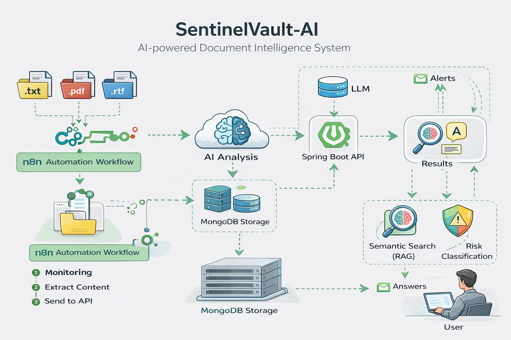

# 🚀 SentinelVault-AI
Secure AI-powered document intelligence for sensitive data detection and semantic retrieval.


---
## 🎯 Why This Project?

Modern systems process large volumes of sensitive documents manually.  
SentinelVault-AI automates this using AI + automation pipelines to:

- Reduce manual auditing effort
- Detect sensitive data instantly
- Provide intelligent search over documents
- Enable real-time risk alerts

## 🧠 Project Overview

SentinelVault-AI is a privacy-focused AI system that automates document analysis by:

- Detecting sensitive data (PII, financial, medical)
- Classifying risk levels (LOW, MEDIUM, HIGH)
- Generating summaries using LLMs
- Enabling semantic search with RAG (Retrieval-Augmented Generation)

---
## 📊 Architecture Diagram


## ⚡ How It Works

1. Files are dropped into a monitored folder
2. n8n workflow detects new files
3. Files are routed based on type (PDF, TXT, RTF)
4. Content is extracted (OCR if needed)
5. Data is sent to Spring Boot backend
6. AI analyzes content (LLM)
7. Risk level + summary generated
8. Embeddings stored in MongoDB
9. Users can query using RAG

## ⚙️ Technical Stack

**Backend**
- Java 22
- Spring Boot
- Spring AI

**Database**
- MongoDB (Document + Vector Storage)

**AI & Processing**
- LLM (Spring AI ChatModel)
- Embeddings for semantic search
- Apache PDFBox (PDF extraction)
- Tesseract OCR (scanned PDFs)

**Automation**
- n8n (workflow orchestration)

---

## 🔄 Architecture & Flow

1. Files are detected via n8n workflow
2. File types are routed (PDF, TXT, RTF)
3. Content is extracted (OCR fallback supported)
4. Data is sent to Spring Boot API
5. AI analyzes and classifies risk
6. Embeddings are generated
7. Data is stored in MongoDB
8. RAG enables intelligent querying

---

## 🔍 Key Features

### 📄 Document Analysis
- Detects sensitive data (Email, Phone, Financial, Medical)
- Generates summaries
- Classifies risk levels

### 🤖 AI Safety Handling
- Handles malformed AI JSON responses
- Uses fallback parsing to prevent crashes

### 🔎 Semantic Search (RAG)
- Context-aware document retrieval
- Example:  
  *“Which documents contain bank details?”*

### 🔄 Automation (n8n)
- Folder monitoring
- File-type routing
- API integration pipeline

---

## 📂 Supported File Types
- PDF (with OCR fallback)
- TXT
- RTF

---

## 📡 API Endpoints

### Analyze Document
POST /vault/analyze

```json
{
  "fileName": "example.pdf",
  "content": "extracted text"
}
```

---

### Upload File
POST /vault/upload

---

### Ask Question (RAG)
POST /vault/ask

```json
{
  "question": "What sensitive data is in my documents?"
}
```

---

### Search Documents
GET /vault/search?query=bank

---

### Get All Documents
GET /vault/history

---

### Filter by Risk
GET /vault/history/risk?level=HIGH

---

### Get Document by ID
GET /vault/history/{id}

---

### Delete Document
DELETE /vault/history/{id}

---

### Stats (Risk Distribution)
GET /vault/stats

---

## 🔄 n8n Workflow

This project includes an automated workflow:

- Monitors folders for new files
- Extracts content (PDF, TXT, RTF)
- Sends data to backend API
- Receives AI risk classification
- Triggers alerts for high-risk documents

📂 Workflow file:  
`/n8n-workflow/sentinelvault-workflow.json`

---

## 🛠️ Setup Instructions

### 1. Clone repository
```bash
git clone https://github.com/RaninduAmarasinghe/sentinel-vault-ai.git
cd sentinel-vault-ai
```

### 2. Start MongoDB
```bash
docker run -d -p 27017:27017 mongo
```

### 3. Run Spring Boot backend
```bash
./mvnw spring-boot:run
```

### 4. Run n8n
```bash
npx n8n
```

---

## 🚀 Future Improvements
- DOCX support
- Image OCR (JPG/PNG)
- Web dashboard (React)
- JWT Authentication
- Cloud deployment
- Whatsapp/Telegram Alerts

---

## 👨‍💻 Author
Ranindu Amarasinghe 
